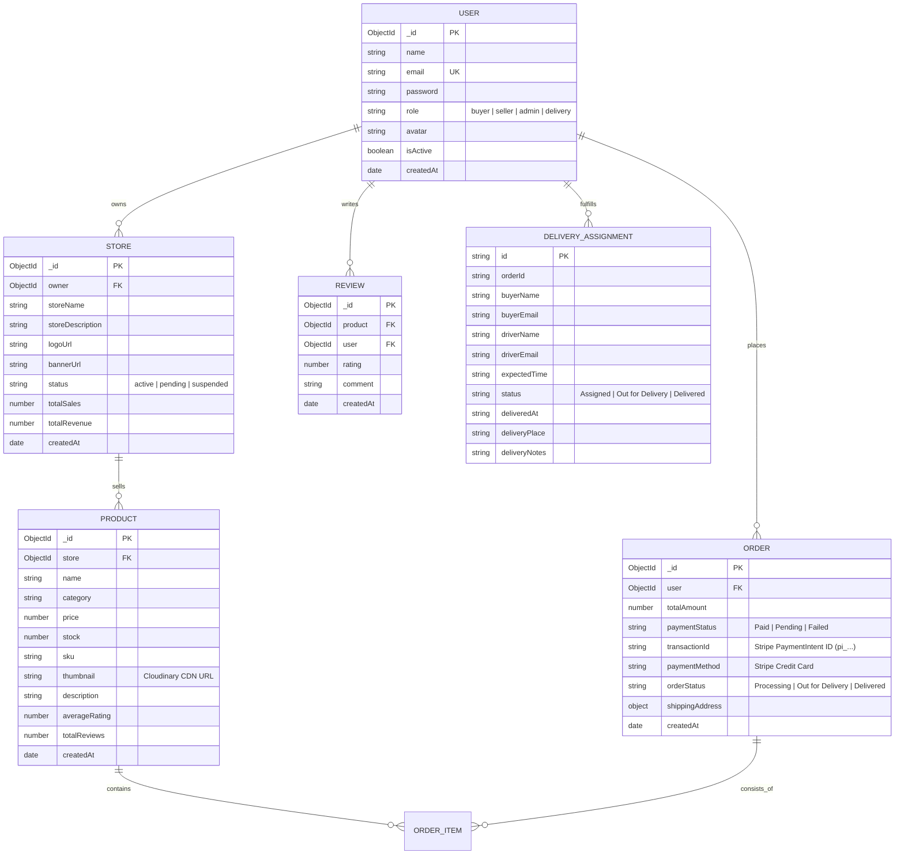

# Database Schema Diagram & ERD (Artisan's Corner)

This document presents the Entity-Relationship Diagram (ERD) and detailed MongoDB collection schemas for **Artisan's Corner Multi-Vendor Marketplace**.

---

## Entity-Relationship Diagram (Mermaid ERD)

---

## Detailed Collections Overview

### 1. `users` Collection
- `_id`: Unique User Identifier (`ObjectId`).
- `name`: User full name.
- `email`: Unique email address.
- `password`: Bcrypt hashed password string.
- `role`: Account access level (`buyer`, `seller`, `admin`, `delivery`).
- `avatar`: Profile picture URL.
- `isActive`: Account status boolean.

### 2. `stores` Collection
- `_id`: Store Identifier (`ObjectId`).
- `owner`: Reference to `users._id` (`ObjectId`).
- `storeName`: Name of artisan shop.
- `storeDescription`: Craftsmanship statement.
- `logoUrl`: Cloudinary CDN logo URL.
- `status`: Verification status (`active`, `pending`, `suspended`).

### 3. `products` Collection
- `_id`: Product Identifier (`ObjectId`).
- `store`: Reference to `stores._id` (`ObjectId`).
- `name`: Product title.
- `category`: Product category (14 distinct categories).
- `price`: Unit price in USD ($).
- `stock`: Available warehouse quantity.
- `sku`: Stock keeping unit identifier.
- `thumbnail`: Cloudinary CDN image URL.

### 4. `orders` Collection
- `_id`: Order Identifier (`ObjectId`).
- `user`: Buyer reference (`users._id`).
- `items`: Array of ordered items (`product`, `quantity`, `price`, `image`).
- `totalAmount`: Grand total ($).
- `paymentStatus`: `Paid` or `Pending`.
- `transactionId`: **Stripe PaymentIntent ID** (`pi_3M...`).
- `paymentMethod`: `Stripe Credit Card`.
- `shippingAddress`: Structured address object (`street`, `city`, `state`, `postalCode`, `country`).

### 5. `deliveries` Collection
- `id`: Unique Dispatch ID (`DEL-XXXX`).
- `orderId`: Order reference (`ORD-XXXX`).
- `driverName`: Assigned door delivery driver.
- `driverEmail`: Delivery partner email (`delivery@example.com`).
- `expectedTime`: Admin expected delivery slot.
- `status`: `Assigned`, `Out for Delivery`, `Delivered`.
- `deliveredAt`: Driver timestamp.
- `deliveryPlace`: Delivery drop-off location.
- `deliveryNotes`: Recipient signature notes.
